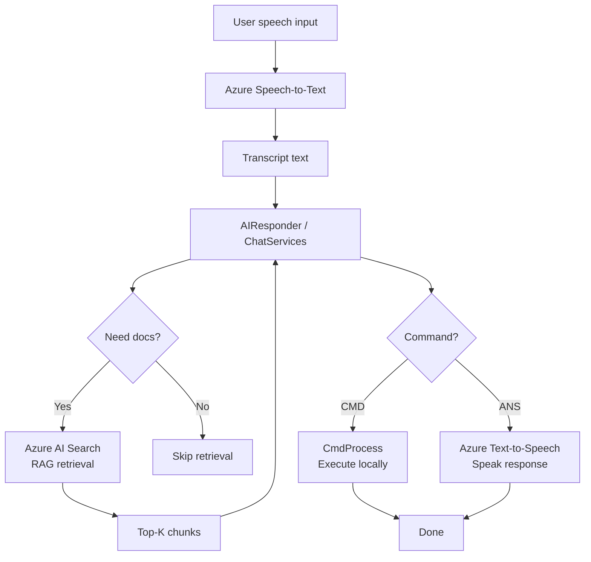
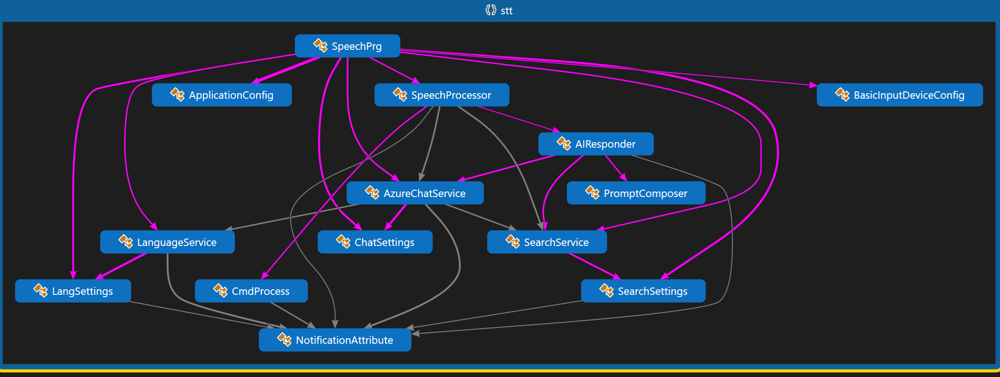

# Simplistic Speech-to-Text / RAG / Text-to-Speech AI Assistant

**Project:** STT  \
**Codename:** function_0  \
**Method:** Cloud-first (with room to hybridize later)  \
**Lang / Dev Env:** C#, .NET 9.0, Visual Studio 2022


## Introduction

I’ve decided to get more serious about AI development, and this project marks my first **working cloud AI deployment**. I chose Azure after earning my Microsoft **AI-900** certification and spending time exploring Azure AI services and AI Foundry. There’s a lot to absorb here, especially around responsible AI and real-world trade-offs.

This repo started life as a **Speech-to-Text (STT)** experiment because voice is both practical and fun to work with. From there, it evolved naturally into something more interesting:

- Speech-to-Text for input
- Azure OpenAI for reasoning
- Retrieval-Augmented Generation (RAG) for grounding responses
- Text-to-Speech so the assistant actually talks back

I also experiment with **local LLMs** using OpenWebUI, Python, and LLaMA, connected through a Twingate VPN so I can access them remotely. Hugging Face is another platform I enjoy exploring. This project represents my shift toward **cloud-based, enterprise-style AI systems**, while still keeping things approachable and well-documented.


## What this application is

This is a **voice-operated AI assistant** built on Azure.

At a high level:

- You speak into a microphone
- Speech is transcribed using **Azure Cognitive Services (Speech)**
- The text is processed by **Azure OpenAI**
- Relevant knowledge is retrieved using **RAG** (Azure AI Search)
- The assistant decides whether to:
  - **Answer** a question ("What is 6 + 2?")
  - **Execute a command** ("Open Task Manager")
- The response is spoken back to you using **Text-to-Speech**
- Some AI Responsible AI principles are applied (for self-harm, negative content, etc through default Azure OpenAI moderation)

It’s intentionally opinionated, but simple. The goal is clarity over cleverness.

> NOTE: Commands are not spoke as they're intended to execute on system. If the tool does not exist on the system, you'll get your typical STDERR message back from the OS. The intention in my examples is to show _custom tools_ and theat the LLM can decide which parameters to use. Typical queries will result in spoken answers.


## Key capabilities

-  **Speech-to-Text (STT)** using Azure Speech Services
-  **LLM reasoning** via Azure OpenAI
-  **Retrieval-Augmented Generation (RAG)** for grounded answers
-  **Text-to-Speech (TTS)** responses through system audio
-  **Command vs Answer routing** (decide when to act vs respond)
-  Modular, readable pipeline (no magic tool routers)


## Technologies used

- **Azure Cognitive Services – Speech SDK**  
  Speech-to-Text and Text-to-Speech

- **Azure OpenAI Service**  
  Natural language understanding and response generation

- **Azure AI Search**  
  Retrieval-Augmented Generation (RAG) - using BM25 lexical ranking / top-K chunk retrieval / LLM reasoning. Vector search is  overkill for this demo.

- **.NET 9.0**  
  Application framework

- **Newtonsoft.Json**  
  Configuration and JSON serialization


## Architecture overview

### Current pipeline (Mermaid)




_code map_


### Conceptual pipeline (where this started)


## Why this design

A few intentionally boring (but important) choices:

- **Single-pass pipeline:** STT -> (optional RAG) -> LLM -> CMD/ANS -> TTS.  
  No hidden loops. No “agent orchestration” mystery meat.

- **RAG is a *sidecar*, not a religion:** If you don’t need docs, don’t pay the latency and token tax.

- **Command execution is gated:** The model doesn’t get to run wild. It must output a clear command form before anything happens.

- **Readable over clever:** This repo is meant to be returned to later. If I can’t re-learn it in 10 minutes, it’s too complicated.


## Branching philosophy

This repo originally used feature branches to make the progression easy to follow.

Going forward, I’ll likely keep it **simple with a single mainline**, because this project is best when it stays easy to navigate.


## File Structure

```text
STT/
├─ .env                          # Local env vars (don’t commit secrets)
├─ .gitattributes
├─ .gitignore
├─ LICENSE
│
├─ stt.sln                       # Visual Studio solution
├─ stt.csproj                    # Project file
│
├─ README.md                     # Main project README (overview)
├─ stt_function_0_runbook_azure_setup.md  # Azure setup/teardown runbook (scripts/)
├─ new-readme2.md                # Scratch/alt README (optional; consider removing later)
│
├─ Program.cs                    # Entry point / app startup
├─ SpeechProcessor.cs            # Speech pipeline: STT and TTS orchestration
├─ AIResp.cs                     # LLM interaction / response shaping (core “brain”)
├─ ChatServices.cs               # Azure OpenAI chat wrapper / client logic
├─ PromptComposer.cs             # Builds prompts (system / user / RAG context)
├─ SearchService.cs              # Azure AI Search queries (RAG retrieval)
├─ LangServices.cs               # Language helpers (keywords, translation, analysis)
├─ CmdProcess.cs                 # Local command execution (when intent routes to CMD)
│
├─ ApplicationConf.cs            # App config (keys/endpoints for demo)
├─ ChatSettings.cs               # Chat configuration options
├─ SearchSettings.cs             # Search configuration options
├─ LangSettings.cs               # Language configuration options
│
├─ Suppl.cs                      # Misc helpers / utilities (catch-all; consider splitting later)
├─ auto-build.cmd                # Convenience build script
│
├─ docs/
│  └─ codemap/
│     ├─ code-flow.md            # Notes on flow / design
│     ├─ CodeMap1.dgml           # Visual Studio Code Map (DGML)
│     └─ mermaid-code-maps.md    # Mermaid diagrams (living documentation)
│
├─ img/                   # Images / diagrams for readme
│  └─ pipeline/
│     ├─ code-map.png
│     ├─ pipelineflow-2025-01-13-1802.excalidraw
│     ├─ pipelineflow-2025-01-13-1802.png
│     └─ pipelineflow-2025-01-13-1802.svg
│
├─ readmes/                # Additional README and docs for AI search
│  ├─ example-readme.txt
│  ├─ README-powerprof.txt
│  └─ JSON/
│     ├─ autodeployhelper.json
│     ├─ createfixversions.json
│     ├─ deployextractor.json
│     ├─ jiraop.json
│     └─ powerprof.json
│
└─ scripts/
   ├─ 000_boot_env.cmd                 # Boot loader: shared env and subscription context
   ├─ buildAzureservicesDeployment.cmd  # Orchestrator: setup everything
   ├─ stt_function_0_runbook_azure_setup.md  # Runbook for scripts (Azure setup/teardown IMPORTANT!!!)
   │
   ├─ 001_group-create-verify.cmd       # Create/verify resource group
   ├─ 002_speech-service-create-verify.cmd  # Speech resource
   ├─ 003_lang-create-verify.cmd        # Language resource (Text Analytics)
   ├─ 004_create_azure-foundry-rc-project.cmd # Foundry project (if used)
   ├─ 005_setup_search_kb.cmd           # AI Search index/knowledge base setup
   ├─ 006_logging-create.cmd            # Log Analytics and diagnostics
   ├─ 007_clean_dirty_env.cmd           # Cleanup local env variables / temp state
   │
   ├─ suppl/
   │  ├─ bop-foundry-open-ai-model.cmd  # Model deployment helper (Foundry/OpenAI)
   │  └─ get_endpoints-keys-for-services.cmd # Print keys/endpoints for app config
   │
   └─ teardown/
      ├─ buildTeardownAll.cmd           # Orchestrator: teardown everything
      ├─ teardown-deploy-model.cmd      # Delete model deployment (avoid hourly costs)
      ├─ teardown-foundry-project.cmd   # Remove Foundry project (if created)
      ├─ teardown-lang-speech-service.cmd # Delete speech and language resources
      ├─ teardown-logging.cmd           # Remove logging/diagnostics and LAW
      ├─ teardown-rc-grp.cmd            # Delete resource group (final sweep)
      └─ teardown-search-indexing-etc.cmd # Remove search index / KB artifacts

```

## Azure setup (important)

**This project assumes Azure resources already exist.**  
The setup and teardown process is documented separately.

**See the dedicated Azure Runbook:**
- `\scripts\stt_function_0_runbook_azure_setup.md`

That runbook covers:
- Resource creation
- Naming conventions
- Cost considerations
- Teardown (so you don’t leak Azure dollars)

This README intentionally avoids duplicating those steps.


## Application build instructions (local)

1. **Install required NuGet packages**

The commands below in case you want to start from scratch. There _is_ an `auto-build.cmd` script that performs a clean build and publishes to a local folder.

```bash
dotnet add package Azure.AI.OpenAI
dotnet add package Microsoft.CognitiveServices.Speech
dotnet add package Newtonsoft.Json
```

2. **Verify packages**

```bash
dotnet list package
```

3. **Restore (if needed)**

```bash
dotnet restore --force-evaluate --no-cache
```

4. **Configure credentials**

For demo purposes, configuration can be set in `%APPDATA%\AppSettings.json`. This can come from after building the services runbook. You'll be able to copy and paste the values into the config file.

```json
{
  "Speaker": "en-US",
  "RC_AZURE_OPEN_AI_KEY": "",
  "RC_AZURE_OPEN_AI_ENDPOINT": "",
  "RC_AZURE_OPEN_AI_DEPLOYMENT": "",

  "Persona": "Your personality is the same as a Working Joe on Alien: Isolation.",
  
  "RC_SPEECH_SERVICE_KEY": "",
  "RC_SPEECH_SERVICE_REGION": "",
  "RC_SPEECH_SERVICE_ENDPOINT": "",
  
  "RC_LANG_ANALYSIS_SERVICE_KEY": "",
  "RC_LANG_ANALYSIS_SERVICE_ENDPOINT": "",
  "RC_LANG_ANALYSIS_SERVICE_REGION": "",
  
  "RC_AI_SEARCH_SERVICE_ENDPOINT": "",
  "RC_AI_SEARCH_SERVICE_KEY": "",
  "RC_AI_SEARCH_SERVICE_QUERY_KEY": "",

  "SpeechVoice": "en-US-JennyNeural",
  "SpeechRecognitionLanguage": "en-US",
  "SpeechFormat": "Raw24Khz16BitMonoPcm",
  "SilenceTimeoutMs": "2000",
  "InitialSilenceTimeoutMs": "6000"
}

```

> For production scenarios, secrets should be stored securely. This project keeps things simple by design.
> All configuration with miX-CasE are not used, but implemented for future expansion.
> If services were created, the `\scripts\suppl\get_endpoints-keys-for-services.cmd` will gather all endpoints and keys for the config file.

5. **Build**

The `auto-build.cmd` script performs a clean build and  publishes to a local folder.


## Final note

This project is intentionally **approachable**. It’s not meant to be the most advanced assistant on the planet. It *is* meant to be understandable, hackable, and a solid foundation for experimenting with modern AI pipelines.

In the source and scripts, I’ve included _plenty_ of comments and documentation to help you follow along. I'm a **HUGE** believer in commented code. It gives me joy of personality that went into it, history, and context when I return to projects months later.

> This document created with the assistance of Chat Gippity 5.2 and Copilot (Dec 2025). 
