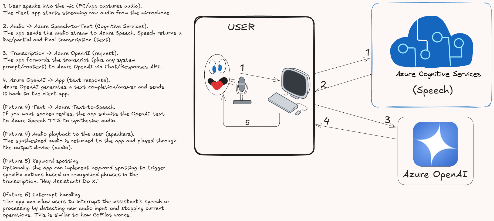

# Simplistic Speech-to-Text and AI Assistant Application

**Project:** STT <BR>
**Codename:** function_0 <BR>
**Method:** Cloud<BR>
**Lang/Dev Env:** C#, .NET 9.0 - Visual Studio 2022.


## Introduction

I’ve decided to get more serious about AI development, and this project marks my first _working cloud_ deployment. I chose Azure because I recently earned my Microsoft AI-900 certification and have been exploring both Azure and Foundry. There’s a lot to learn, especially around responsible AI practices.

For the first stage of this project, I wanted to start with Speech-to-Text (STT) using Azure OpenAI since it’s both practical and fun to work with.

I also experiment with local large language models using OpenWebUI, Python, and LLaMA, connected through a Twingate VPN backend so I can access them remotely. Hugging Face is another platform I really enjoy exploring!

This project represents my shift toward cloud-based AI development to gain stronger enterprise-level experience.


This application is a **voice-operated assistant** that integrates **Azure Cognitive Services** and **Azure OpenAI** to provide speech-to-text 
transcription, natural language understanding, and respond to queries or execute commands. The end user will give utterances, it is then transcribed, sent to a model, and determines if it should **answer** ("What is 6 + 2?!") or **execute a command** on the local system ("Open task manager!")

In this project, I’ll be separating new features into individual branches to make it easier for others to follow the progression. I’ve often found myself spending a lot of time reading through large amounts of uncommented or undocumented code, so my goal here is to make the development process clearer. By separating features into branches, it’s easier to see how the project builds up step by step.


## Technologies Used
- **Azure Cognitive Services Speech SDK**: For speech-to-text transcription and text-to-speech synthesis.
- **Azure OpenAI Service**: For natural language understanding and generating responses.
- **.NET9.0**: Application framework.
- **Newtonsoft.Json**: For configuration management and JSON serialization.


## Architecture Overview
### ...and future pipeline flow


### Current Pipeline Flow
This is _somewhat_ similar to the image above, but with some differences. The current flow is as follows:

1. **Speech-to-Text**:
- The application captures audio input from the microphone.
- Azure Cognitive Services transcribes the audio into text.

2. **Natural Language Understanding**:
- The transcribed text is sent to Azure OpenAI for processing.
- Azure OpenAI generates a response or command based on the input.

3. **Queries/Command Execution**:
- If the response is a command (example: " List all drives under current directory" or "Open notepad"), the application executes it.
- If the response is an answer to query, it is displayed to the user.


## Future Enhancements
1. **Text To Speech AI responses**:
 - Play synthesized audio responses directly through the system's device output.

2. **Keyword Spotting**:
 - Implement keyword spotting to trigger specific actions based on recognized phrases ("Hey Assistant! Do X!").

3. **Interrupt Handling**:
 - Allow users to interrupt the assistant's speech or processing by detecting new audio input and stopping current operations.


## Azure Setup

To get all of this to work, you'll need to set up Azure services: Azure Cognitive Services for Speech and Azure OpenAI Service. Once these are set up, you'll need to deploy a model in Azure OpenAI and get the necessary keys and endpoints.

Finally, in the application, you'll need to configure the keys and endpoints for both services. After compilation, the application will now use the services and models you've set up in Azure.

  > Note: Embedding the keys directly in the code is not recommended for production applications. Consider using secure configuration management practices. This is done here for simplicity and demonstration purposes.

### Azure Speech Services

<details>
<summary><strong>Creating Resources Without Templates (for the hardcore CLI users...) [click to expand]</strong></summary>

First, let's check to see any of the resources we need exist: 

### Check if the following resources exist (Resource group, Azure OpenAI, Speech)

If JSON output happens, then the resource you queried against will exist or report it cannot be found. 

```
az group show --name rc-speech-grp-001 
az cognitiveservices account show --name rc-AzureOpenAI-Foundry2 --resource-group rc-speech-grp-001
az cognitiveservices account show --name rc-SpeechService --resource-group rc-speech-grp-001
az cognitiveservices account deployment show  --resource-group rc-speech-grp-001  --name rc-AzureOpenAI-Foundry2  --deployment-name chat-gpt-deployment
```


### Step 1: Create the Resource Group
```
az group create --name rc-speech-grp-001 --location westus
```

### Step 2: Create Azure OpenAI Resource
Note: 
`--identity-type` not used because we're not using managed identity in this example.
`--api-properties` not used because we're not setting any special properties in this example.

 - Azure OpenAI (S0): This is a paid tier. Even idle deployments may incur charges depending on quota and throughput settings.

```
az cognitiveservices account create  --name rc-AzureOpenAI-Foundry2  --resource-group rc-speech-grp-001   --kind OpenAI   --sku S0   --location westus   --custom-subdomain-name rc-azureopenai-foundry2  --tags service=ai  --public-network-access Enabled

```


### Create Speech Services Resource

```
az cognitiveservices account create \
  --name rc-SpeechService \
  --resource-group rc-speech-grp-001 \
  --kind SpeechServices \
  --sku F0 \
  --location westus \
  --tags service=speech \
  --public-network-access Enabled

```


### Step 3: Create Foundry project

At the moment, az CLI does not support foundry. You'll have to do it through the UIO at ai.azure.com

- Select + Create New
- Choose AI Foundry resource
- In the create project dialogue window, enter "proj-speech-function" for the project name. 
- Expand the `Advanced options`.

Fill in the following:
- Resource Group: rc-speech-grp-001
- Azure AI Foundry resource: rc-AzureOpenAI-Foundry2
- Subscription: {your subscription name}
- Region: westus

- Click Create

  > Creating project and resources may take several minutes (typically about 3-5 minutes).


### Step 4: Deploy a GPT Model to Azure OpenAI (Provisioned input)
Note: 
`--name` must match the Cognitive Services resource name (rc-AzureOpenAI-Foundry2)
- Model Deployment (sku-capacity 1): This allocates provisioned throughput. If you don't need guaranteed performance, consider using on-demand instead of provisioned.

```
az cognitiveservices account deployment create --resource-group rc-speech-grp-001 --name rc-AzureOpenAI-Foundry2 --deployment-name chat-gpt-deployment --model-name gpt-4o-mini --model-version 2024-07-18 --model-format OpenAI --sku-name Standard --sku-capacity 1

```

### Step 5: Validate Resources
```
az resource list --resource-group rc-speech-grp-001 -o table
```


### Teardown with the following:
```
az group delete --name rc-speech-grp-001 --yes --no-wait
```

To delete Foundry project, 

- In AI Foundry, at the bottom of the site, go to Management center if you're in a resource, choose project, then delete.
- In AI Foundry, choose the project (listed beside the resource) and this will direct you in the Management center. if you're in a resource, choose project, then delete.
- You can remove it from Azure portal by going into the resource group, choosing the project, and then delete (not delete resource group).

## Explanation of Switches and Parameters

### `-n` (or `--name`)
- Specifies the name of the resource.
- Example: `az cognitiveservices account create -n MyCognitiveService`

### `--query`
- Filters the output using JMESPath query.
- Example: `az resource list --query "[?type=='Microsoft.CognitiveServices/accounts']"`

### `-o` (or `--output`)
- Specifies the output format.
- Options: `json` (default), `table`, `tsv`, `yaml`.
- Example: `az resource list -o table`
</details>

<P>


1. **Create a Speech Service Resource**:
 - Go to the [Azure Portal](https://portal.azure.com).
 - Search for "Speech" and create a new Speech Service resource.
 - Note the **key**, **region**, and **endpoint**.

2. **Enable Speech-to-Text and Text-to-Speech**:
 - Ensure both transcription and synthesis capabilities are enabled.

### Azure OpenAI Service
1. **Create an Azure OpenAI Resource**:
 - Go to the [Azure Portal](https://portal.azure.com).
 - Search for "Azure OpenAI" and create a new resource.
 - Note the **key**, **endpoint**, and **deployment name**.

2. **Deploy a Model**:
 - In the Azure OpenAI resource, deploy a model like `gpt-4-mini` or `gpt-3.5-turbo`.
 - Note the deployment name for use in the application.

## Application Build Instructions


1. **Install Required Packages**:

In the project directory, run the following commands to install the necessary NuGet packages, under the Nuget package manager console:

 ```
 dotnet add package Azure.AI.OpenAI
 dotnet add package Microsoft.CognitiveServices.Speech
 dotnet add package Newtonsoft.Json
 ```

2. **Verify Installed Packages**:
 ```
 dotnet list package
 ```

3. **Clear NuGet Cache and Restore**:
 Probably don't need this, _but_ just in case! 
 
 ```
 dotnet nuget locals all --clear
 dotnet restore --force-evaluate --no-cache
 ```

4. **Build the Application**:
			
  > Note:  Before building, this is where you configure your Azure Cognitive Services and Azure OpenAI keys and endpoints. This is done in `ApplicationConfig.cs` (just don't publish it in production). <BR><BR>Simply modify the following for defaults:

```
      RC_AZURE_OPEN_AI_KEY = "XXX", // Azure OpenAI key 
      RC_AZURE_OPEN_AI_ENDPOINT = "XXX", // Azure OpenAI endpoint 
      RC_AZURE_OPEN_AI_DEPLOYMENT = "XXX", // model deployment
      RC_SPEECH_SERVICE_ENDPOINT = "XXX", // Azure Speech service endpoint
      RC_SPEECH_SERVICE_KEY = "XXX", // Azure Speech service key
      RC_SPEECH_SERVICE_REGION = "westus2", // Azure Speech service region
```
  > If you do not chase this method, then run the application, and configure the `appsettings.json` in your 
`%APPDATA%` folder (APPDATA=C:\Users\{user}\AppData\Roaming\AppSettings.json). The configuration method is crude, but it works for demonstration purposes.

 ```
 dotnet build
 ```


##  Active Branches
| Branch | Description |
|---------|-------------|
| `main` | README.md (your project intro, branching policy, etc.) |
| `feature/winters/initial-commit` | Initial commit, first working build |
| `develop/winters/*` | Active development branch (will update this soon) |


